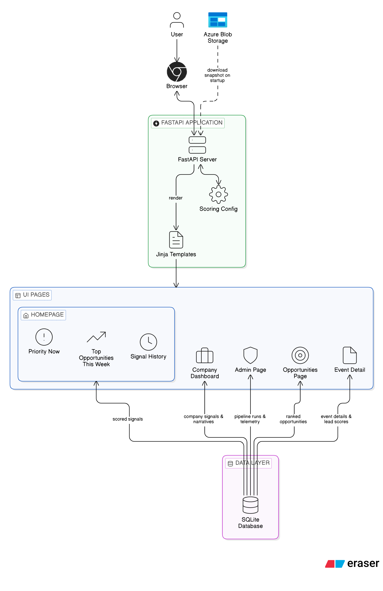
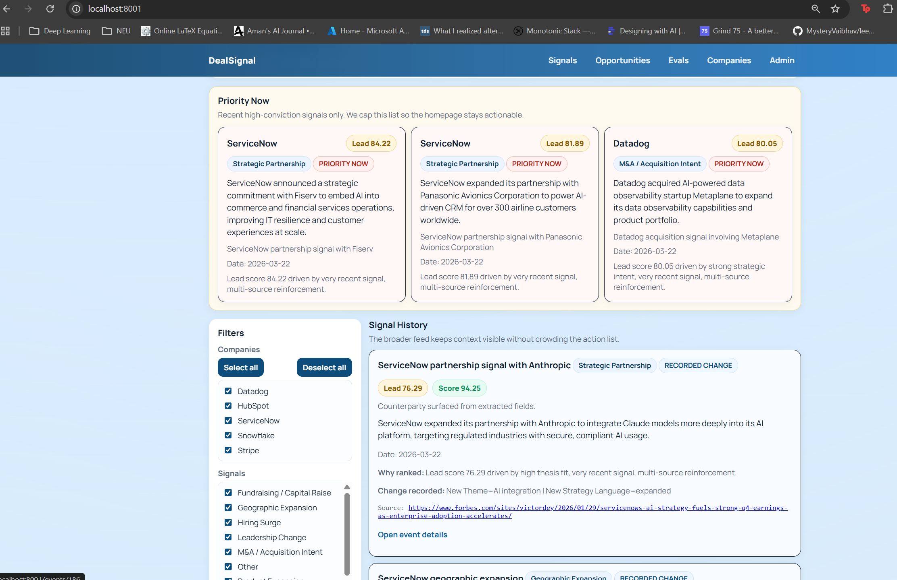
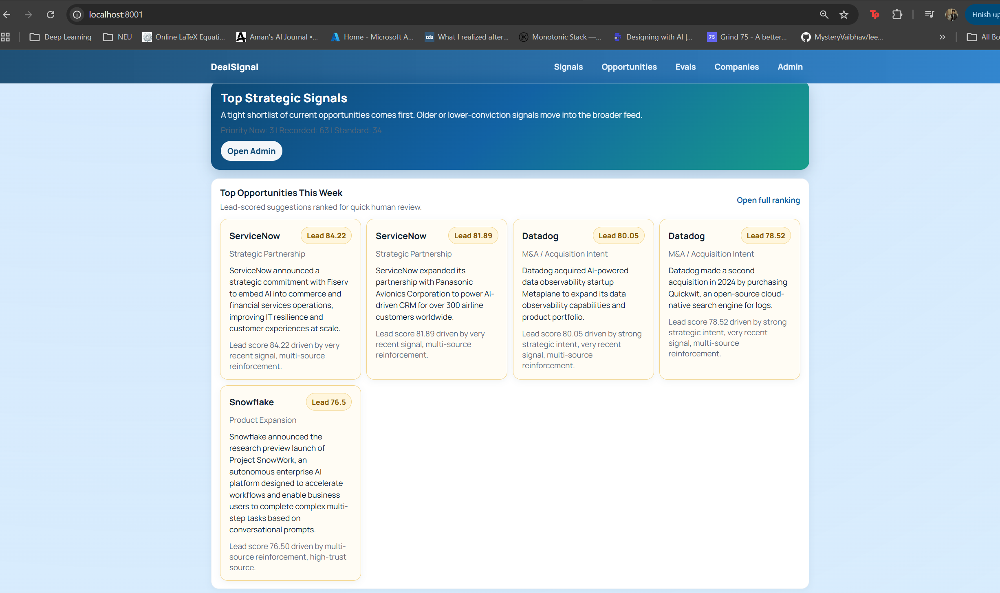
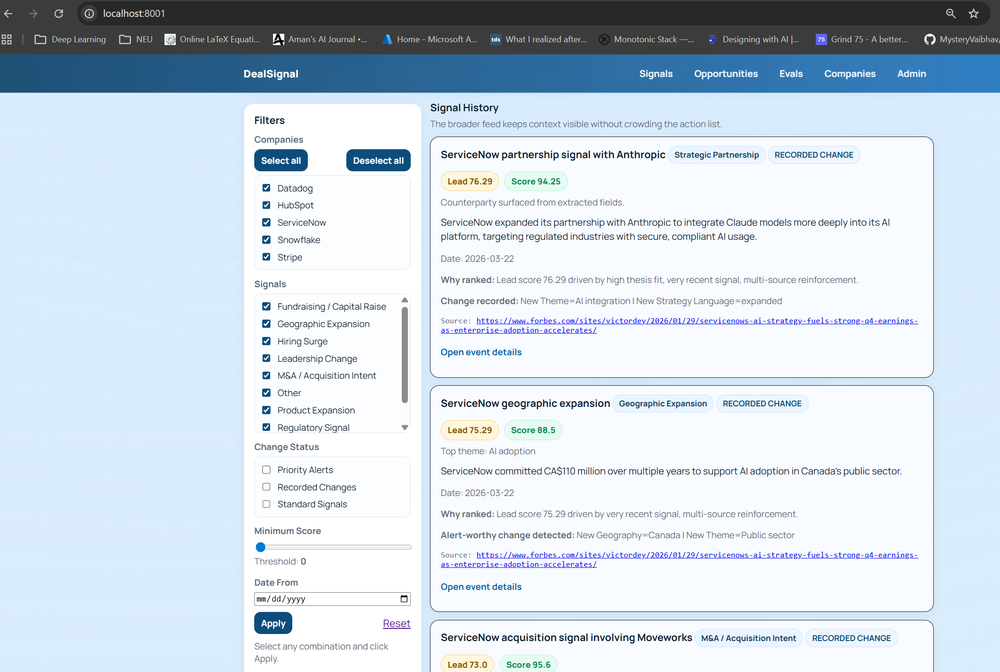
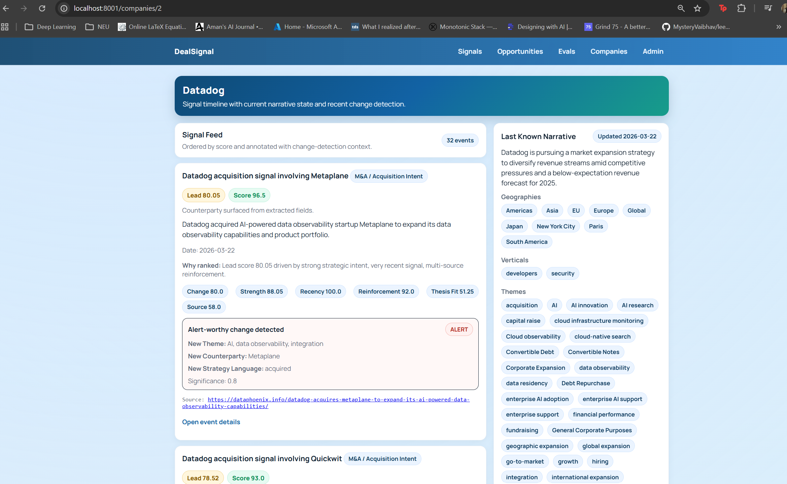
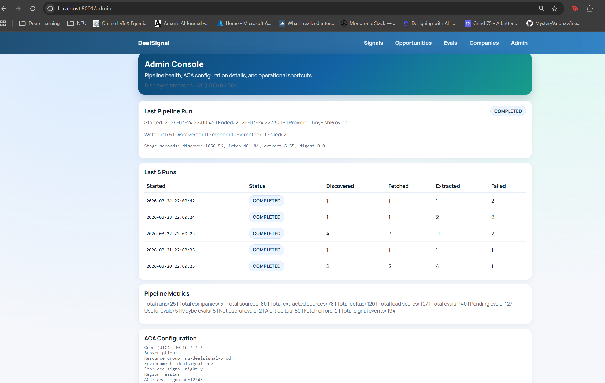
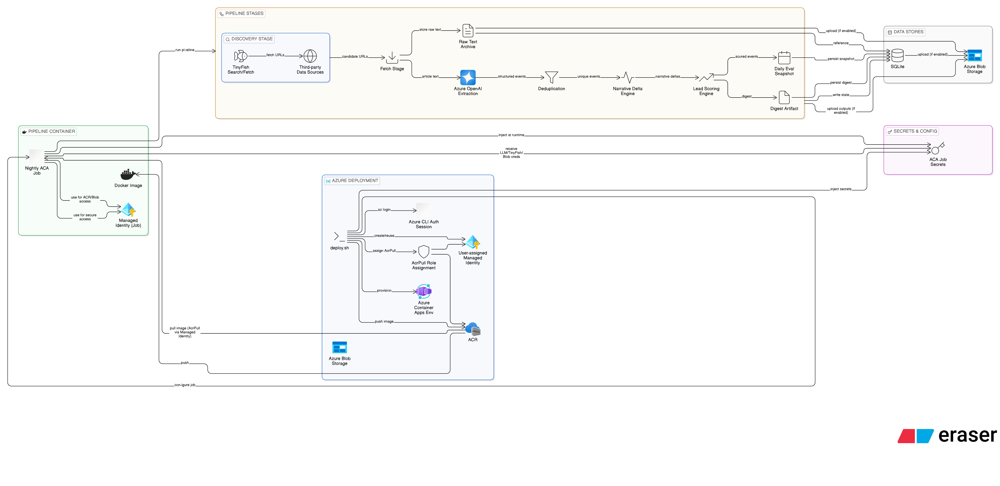
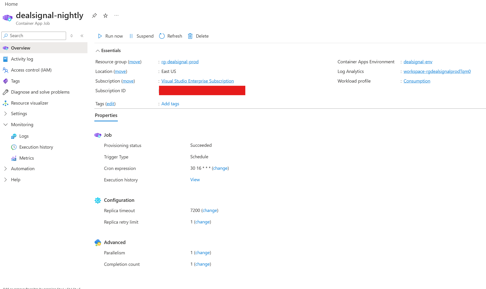
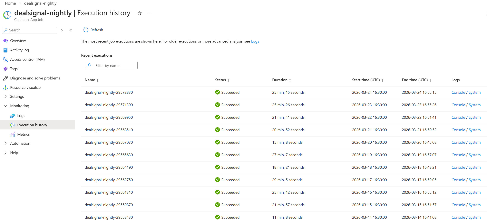

# DealSignal

DealSignal helps a deal team spot the small public signals that often appear before a company becomes a strong outreach target.

Instead of asking a human to manually track interviews, press releases, funding news, hiring moves, expansion plans, and partnership announcements across a watchlist, DealSignal does that work continuously and turns it into a short, ranked list of companies worth acting on now.

## The Business Problem

The problem is not a lack of information.

The problem is that too much signal is buried inside too much noise.

A sourcing team may care deeply about a small set of companies, but those companies produce information across dozens of places:

- executive interviews
- press releases
- company blogs
- news articles
- funding coverage
- product announcements
- partnership announcements

By the time a human manually reads enough of that material to notice a pattern, the moment to engage may already be gone.

Most teams therefore fall into one of two bad outcomes:

1. they monitor too little and miss important changes
2. they monitor too much and overwhelm themselves with alerts that do not lead to action

DealSignal is built to solve that second problem as much as the first one. It is not just a monitoring tool. It is a prioritization engine for sourcing.

## What We Are Solving

We are trying to answer a simple commercial question:

Which companies on our watchlist are showing fresh, meaningful, externally visible signs that make them better targets for outreach right now?

That means the system has to do more than collect articles.

It has to:

- find relevant new public information
- understand what changed
- decide whether the change matters
- rank opportunities so users can focus on a small number of companies

## What DealSignal Does

DealSignal watches a target list of companies and converts public information into a ranked opportunity feed.

At a high level, it:

1. searches the web for high-signal company updates
2. fetches and stores the source text
3. extracts strategic signals from the text with an LLM
4. compares each new signal against what was already known about that company
5. scores the signal for importance and actionability
6. shows a curated shortlist in the UI

The result is a homepage that is meant to answer:

- what matters now?
- why does it matter?
- which companies should we approach first?

## ROI And Benefits

### 1. Less Manual Research Time

Analysts and deal team members spend less time searching for scattered updates and more time reviewing a shortlist of pre-ranked opportunities.

### 2. Better Timing

Outreach improves when it is based on a recent, real business move such as expansion, fundraising, or a new partnership instead of a generic cold pitch.

### 3. More Consistent Coverage

A team can monitor more companies than a human researcher can realistically track by hand.

### 4. Better Prioritization

Not every interesting event deserves action. DealSignal tries to separate:

- things that are merely interesting
- things that changed in a meaningful way
- things that are recent and high-conviction enough to act on now

### 5. Stronger Future Fit With CRM Workflows

Today the system ranks public signals. Later it can become much more powerful by adding:

- CRM relationship context
- account owner context
- past outreach history
- warm connection signals

That means the project can grow from "monitoring" into "deal sourcing intelligence."

## How To Think About The Engine

The easiest way to understand DealSignal is to imagine a junior analyst who never sleeps.

That analyst does five jobs:

1. looks for new company information
2. reads it
3. writes down what happened
4. checks whether this is actually new for that company
5. decides whether the team should care right now

DealSignal automates those five jobs.

## ELI5: How The Engine Works

Here is the simple version.

### Step 1. We Start With A Watchlist

We tell the system which companies we care about.

For each company, we can also give the system some helpful context:

- executive names
- themes we care about
- sector
- aliases

This tells the engine where to focus and what "good fit" looks like.

### Step 2. The Engine Searches For Fresh Public Clues

It runs targeted search queries like:

- company expansion plans
- company partnership announcement
- company fundraising round
- company acquisition plans

This is not broad internet crawling for everything. It is guided discovery around specific strategic motions.

### Step 3. It Fetches The Article Text

When the system finds a candidate URL, it fetches the actual article text and stores it.

This gives us a stable record of what was read and what the scoring later came from.

### Step 4. It Extracts Strategic Signals

An LLM reads the article and pulls out structured information such as:

- signal type
- short summary
- evidence excerpt
- geography
- counterparties
- themes
- confidence
- strength

In plain English, this turns "a long article" into "a structured fact pattern."

### Step 5. It Asks: Is This Actually New?

This is one of the most important parts.

Many articles repeat what was already known. DealSignal compares the new event against the company's existing narrative and asks whether there is a meaningful change such as:

- a new geography
- a new vertical
- a new theme
- a new counterparty
- a new strategic phrase

That is how the system tries to detect movement, not just mentions.

### Step 6. It Scores The Opportunity

Once the system sees a real event, it calculates scores that help answer:

- how meaningful was the change?
- how strong is the business intent?
- how recent is it?
- is it reinforced by multiple sources?
- does it fit our thesis?
- is the source trustworthy?

Then it rolls those into a final lead score.

### Step 7. It Curates The UI

The homepage is not supposed to be an endless list of alerts.

The system now separates:

- `Priority Now`: recent, high-conviction items worth acting on now
- `Top Opportunities This Week`: ranked suggestions across the past week
- `Signal History`: broader context and older changes

That lets a user open the app and quickly decide where to focus.

## The Scores, Explained Like I'm Five

The system uses a few simple ideas and combines them.

### 1. Change Significance

Question:
Did something meaningfully change for this company?

Examples:

- new market entered
- new partnership surfaced
- new strategic direction mentioned

Why it matters:
If nothing new happened, there is less reason to act.

### 2. Signal Strength

Question:
How explicit is the business intent?

Examples:

- "we are actively exploring acquisitions" is strong
- "we are excited about AI" is weak

Why it matters:
Clear intent is more useful than vague language.

### 3. Recency

Question:
Did this happen recently, or is it already stale?

Why it matters:
Timing is part of opportunity quality. A strong signal from yesterday is usually more useful than a strong signal from three weeks ago.

### 4. Reinforcement

Question:
Are multiple independent sources pointing to the same thing?

Why it matters:
A signal is more trustworthy when it shows up across multiple credible places instead of only once.

### 5. Thesis Fit

Question:
Does this look like the kind of company motion we care about?

Examples:

- expansion into a market we care about
- themes that match our investment or partnership thesis
- strategic moves inside sectors we prioritize

Why it matters:
An important signal is not automatically our signal. This score helps align the engine with what the team actually wants.

### 6. Source Quality

Question:
How much should we trust where this came from?

Examples:

- SEC filing or Reuters: high trust
- weaker or noisier web source: lower trust

Why it matters:
Better sources reduce wasted time and false urgency.

## How The Final Lead Score Is Used

The lead score is the engine's attempt to answer:

If a human only has time to review a few companies today, which ones should rise to the top?

The score is not meant to replace judgment.

It is meant to:

- compress lots of scattered public information
- give users a ranked first pass
- explain why something is surfacing
- make review faster and more consistent

In practice, the score is used in three ways:

### 1. Ranking

Higher-scoring items rise toward the top of the weekly opportunity list.

### 2. Filtering

The app can narrow what users see so the feed stays action-oriented.

### 3. Priority Curation

The homepage uses recentness and lead score to avoid showing too many "urgent" items at once.

This matters because too many alerts destroy the meaning of alerts.

## Current Priority Logic

An item is shown as `Priority Now` only when it passes all of these checks:

- the narrative change is alert-worthy
- the lead score is at least `80`
- the event is within the last `7` days

The homepage also limits how many current priority items show up from the same company, so one company cannot flood the page.

## What The User Sees

Today the product is a local web app backed by a pipeline.

Main pages:

- `/`: curated signal feed
- `/companies`: company list
- `/companies/{id}`: company-specific signal history
- `/events/{id}`: individual event detail and score explanation
- `/opportunities`: ranked weekly opportunities
- `/admin`: pipeline and deployment telemetry

## Serve Architecture

This diagram shows the serve-side architecture: the local FastAPI app, the curated UI layers, and how the app reads shared state from SQLite and optional Blob-backed sync.



### Priority Now

This is the most action-oriented part of the product. It is meant to answer: what should we act on now?



### Top Opportunities This Week

This view gives users a ranked weekly shortlist with score-backed explanations.



### Signal History

This is the broader feed that keeps context visible without overwhelming the primary action list.



### Company Dashboard

This view helps a user understand one company in context: recent signals, narrative shifts, and top opportunities tied to that company.



### Admin Panel

This gives operators visibility into the pipeline, recent runs, and deployment metadata.



## Repository Layout

- `serve/`: full local runtime, UI, pipeline, tests, configs
- `azure_artifacts/`: Azure Container Apps build and deploy assets
- `.env`: shared environment variables
- `.env.example`: template for local and cloud configuration
- `product_iterations/`: product notes and milestone docs

## Local Setup

Requirements:

- Python 3.11+
- `uv`
- Azure OpenAI deployment
- TinyFish API key
- optional Azure Blob Storage for shared state

Install dependencies from the `serve/` directory:

```bash
cd serve
uv sync --dev
```

Environment variables live in the parent `.env` file. Both `main.py` and `run_pipeline.py` load `../.env` automatically.

Important variables:

```bash
LLM_API_KEY=...
LLM_BASE_URL=https://<your-azure-openai-resource>.openai.azure.com/
LLM_MODEL=<your-azure-deployment-name>
LLM_API_VERSION=2024-02-15-preview

TINYFISH_API_KEY=...
TINYFISH_BASE_URL=https://agent.tinyfish.ai
TINYFISH_MAX_AGENTS=2

DATABASE_URL=sqlite:///./dealsignal.db

BLOB_SYNC_ENABLED=true
AZURE_STORAGE_CONNECTION_STRING="DefaultEndpointsProtocol=https;AccountName=<storage-account>;AccountKey=<storage-key>;EndpointSuffix=core.windows.net"
BLOB_CONTAINER=dealsignal
BLOB_DB_BLOB_NAME=state/dealsignal.db
BLOB_RAW_PREFIX=raw
```

## Run The App

From `serve/`:

```bash
uv run python main.py serve
```

Local UI starts at `http://127.0.0.1:8001`.

On startup, the app can pull the latest SQLite snapshot from Blob so local users see the most recent shared state.

## Run The Pipeline

From `serve/`:

```bash
uv run python main.py run-pipeline
```

or:

```bash
python run_pipeline.py
```

Pipeline stages:

1. load watchlist
2. discover candidate URLs
3. fetch and archive raw text
4. extract structured signals with Azure OpenAI
5. dedupe by event fingerprint
6. score events
7. write digest artifact

## Pipeline Architecture

This diagram shows the nightly batch pipeline architecture, including discovery, fetch, extraction, scoring, persistence, and Azure Container Apps deployment.



## Azure Deployment

Deploy from the workspace root:

```bash
chmod +x azure_artifacts/deploy.sh
./azure_artifacts/deploy.sh
```

The Azure Container Apps job builds from `serve/` and runs `python run_pipeline.py`.

### ACA Job Details

This view shows the deployed Container Apps job and its runtime configuration.



Useful commands:

Manual trigger:

```bash
az containerapp job start --name dealsignal-nightly --resource-group rg-dealsignal-prod
```

Latest execution name:

```bash
EXEC=$(az containerapp job execution list --name dealsignal-nightly --resource-group rg-dealsignal-prod --query "[0].name" -o tsv)
```

Stream logs for latest execution:

```bash
EXEC=$(az containerapp job execution list --name dealsignal-nightly --resource-group rg-dealsignal-prod --query "[0].name" -o tsv)
az containerapp job logs show --name dealsignal-nightly --resource-group rg-dealsignal-prod --execution "$EXEC" --container pipeline --follow
```

### ACA Execution History

This view shows recent pipeline executions in Azure so operators can quickly inspect job health and run cadence.



## Shared State

When blob sync is enabled, the system persists:

- SQLite database to Blob
- raw fetched article text to Blob

That allows local runtime and cloud pipeline runs to share state.

## Tests

From `serve/`:

```bash
uv run pytest -q
```

## More Technical Detail

For runtime-specific notes, see [serve/README.md](C:/Users/deril/OneDrive/Desktop/Deril/Development/DealSignal-AI-in-the-Wild/serve/README.md).
